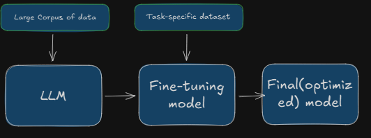

#### If notebook is not visible then please click on following link.
[Notebook_1](https://drive.google.com/file/d/1fjrpKmWEVomdimeI6LMmP9_L6Xr_g0MH/view?usp=sharing)

## **Fine-Tuning Large Language Models (LLMs)**

Fine-tuning refers to the process of taking a **pre-trained large language model** and adapting it to a **specific downstream task** by training it further on a smaller, domain-specific dataset. This approach refines the model’s capabilities and improves accuracy for specialized tasks without requiring massive datasets or extremely expensive computational resources.

In this project, I am implementing **fine-tuning of a Large Language Model using the DialogSum dataset**.  
Before diving into the implementation, let’s first understand the **working mechanism and types of fine-tuning**.

---

### **Fine-Tuning Workflow**

  

  <em>Figure 1: End-to-end workflow of fine-tuning a Large Language Model</em>

---

### **General Fine-Tuning Process**

The fine-tuning process can be broken down into the following key steps:

1. **Select Base Model**  
   Choose a suitable pre-trained model based on the task requirements and available computational budget.

2. **Choose Fine-Tuning Method**  
   Select an appropriate fine-tuning approach such as:
   - Instruction Fine-Tuning  
   - Supervised Fine-Tuning  
   - Parameter-Efficient Fine-Tuning (PEFT)  
   - LoRA / QLoRA  

   The choice depends on the task complexity and dataset size.

3. **Prepare Dataset**  
   Structure and preprocess the dataset to match the input-output format expected by the model.

4. **Training**  
   Fine-tune the model using deep learning frameworks such as **PyTorch** or **TensorFlow**, or high-level libraries like **Hugging Face Transformers**.

5. **Evaluate and Iterate**  
   Evaluate the model performance, refine hyperparameters, and retrain if necessary to improve results.

---

### **Types of Fine-Tuning Methods**

1. **Supervised Fine-Tuning (SFT)**  
2. **Instruction Fine-Tuning**  
3. **Parameter-Efficient Fine-Tuning (PEFT)**  
4. **Reinforcement Learning with Human Feedback (RLHF)**  

---
